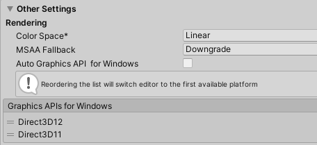
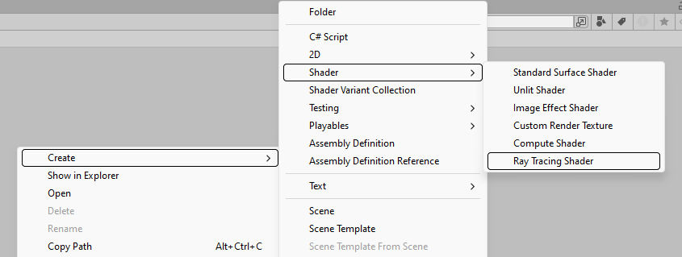

<div align="center">

# Ray Tracing SRP

Unity RTX On!

</div>

## Table of Content:

- [GPU Ray Tracing](#)
  - [Overview](#overview)
     - [Setting Up the Environment](#setting-up-the-environment)
     - [Import the Dependencies](#import-the-dependencies)
  - [1. Outputting an Image](#1-outputting-an-image)
    - [1.1. Create a RayTraceShader in Unity](#11-create-a-raytraceshader-in-unity)
    - [1.2. Rendering in C# using the SRP Pipeline](#12-rendering-in-c-using-the-srp-pipeline)
    - [1.3. Final Output](#13-final-output)
  - [2. Outputting the Background](#2-outputting-the-background)
    - [2.1. Create a RayTraceShader in Unity](#21-creating-a-raytraceshader-in-unity)
    - [2.2. Rendering in C# using the SRP Pipeline](#22-rendering-in-c-using-the-srp-pipeline)
    - [2.3. Final Output](#23-final-output) 

## Overview

This tutorial is based on [Ray Tracing in One Weekend](https://raytracing.github.io/books/RayTracingInOneWeekend.html)
and explains how to implement Ray Tracing using Unity's SRP and DXR. Therefore,
before reading this article, it’s recommended to first go through the tutorial.
The algorithms are explained there, so this guide will focus on implementing Ray
Tracing in Unity.

### Setting Up the Environment

This implementation is based on Unity 2020+ with integrated DXR, requiring basic
configuration for the Unity project.



The first step is to set the Graphics API to Direct3D12.

### Import the Dependencies

Since we are using the SRP (Scriptable Render Pipeline) library, the following
Unity packages must be imported:


## 1. Outputting an Image

**Tutorial class**: `OutputColorTutorial`

**Scene file**: `OutputColorTutorialScene`

Generating the coord image using Ray Tracing Shader is a great starting point
for exploring its capabilities.

### 1.1. Create a RayTraceShader in Unity

To create a Ray Trace Shader in Unity, follow these steps: In the `Project`
panel, right click and select `Create → Shader → Ray Tracing Shader`.



Replace the content of the shader with the following code:

```glsl
#pragma max_recursion_depth 1

RWTexture2D<float4> _OutputTarget;

[shader("raygeneration")]
void OutputColorRayGenShader()
{
  uint2 dispatchIdx = DispatchRaysIndex().xy;
  uint2 dispatchDim = DispatchRaysDimensions().xy;

  _OutputTarget[dispatchIdx] = float4((float)dispatchIdx.x / dispatchDim.x, (float)dispatchIdx.y / dispatchDim.y, 0.2f, 1.0f);
}
```

* **DispatchRaysIndex().xy** returns the current pixel position.

* **DispatchRaysDimensions().xy** returns the dimensions of the render target.

This code adjusts the R and G channels of each pixel: the R channel ranges from
0 to 1 from left to right, the G channel from 0 to 1 from bottom to top, while
the B channel remains constant at 0.2 for all pixels.

### 1.2. Rendering in C# using the SRP Pipeline

The following C# code integrates the shader into Unity's render pipeline:

```csharp
var outputTarget = RequireOutputTarget(camera);

var cmd = CommandBufferPool.Get(typeof(OutputColorTutorial).Name);
try
{
  using (new ProfilingSample(cmd, "RayTracing"))
  {
    cmd.SetRayTracingTextureParam(_shader, _outputTargetShaderId, outputTarget);
    cmd.DispatchRays(_shader, "OutputColorRayGenShader", (uint) outputTarget.rt.width, (uint) outputTarget.rt.height, 1, camera);
  }
  context.ExecuteCommandBuffer(cmd);

  using (new ProfilingSample(cmd, "FinalBlit"))
  {
    cmd.Blit(outputTarget, BuiltinRenderTextureType.CameraTarget, Vector2.one, Vector2.zero);
  }
  context.ExecuteCommandBuffer(cmd);
}
finally
{
  CommandBufferPool.Release(cmd);
}
```

* **RequireOutputTarget** retrieves the render target based on the camera's
  output.

* **cmd.SetRayTracingTextureParam** sets the render target for the Ray Trace
  Shader. Here, *_shader* refers to the Ray Tracing Shader Program, and
  *_outputTarget* is obtained via `Shader.PropertyToID("_OutputTarget")`.

* **cmd.DispatchRays** invokes the ray generation function `OutputColorRayGenShader`
  in the RayTrace Shader for Ray Tracing.

Since the Ray Trace Shader only renders to a render target, a Blit operation is
required to display the result on the screen.

### 1.3. Final Output

After setting everything up, running the code should produce the following image:


## 2. Outputting the Background

**Tutorial class**: BackgroundTutorial

**Scene file**: BackgroundTutorialScene

In this tutorial, we will render a gradient background using Ray Tracing.

### 2.1. Creating a RayTraceShader in Unity

Create the following Ray Tracing Shader to generate the background:

```glsl
inline void GenerateCameraRay(out float3 origin, out float3 direction)
{
  // center in the middle of the pixel.
  float2 xy = DispatchRaysIndex().xy + 0.5f;
  float2 screenPos = xy / DispatchRaysDimensions().xy * 2.0f - 1.0f;

  // Un project the pixel coordinate into a ray.
  float4 world = mul(_InvCameraViewProj, float4(screenPos, 0, 1));

  world.xyz /= world.w;
  origin = _WorldSpaceCameraPos.xyz;
  direction = normalize(world.xyz - origin);
}

inline float3 Color(float3 origin, float3 direction)
{
  float t = 0.5f * (direction.y + 1.0f);
  return (1.0f - t) * float3(1.0f, 1.0f, 1.0f) + t * float3(0.5f, 0.7f, 1.0f);
}

[shader("raygeneration")]
void BackgroundRayGenShader()
{
  const uint2 dispatchIdx = DispatchRaysIndex().xy;

  float3 origin;
  float3 direction;
  GenerateCameraRay(origin, direction);

  _OutputTarget[dispatchIdx] = float4(Color(origin, direction), 1.0f);
}
```

* **GenerateCameraRay** calculates the origin and direction of the ray for the
  current pixel.

* The **Color** function calculates a gradient from top to bottom, creating the
  background effect.

### 2.2. Rendering in C# using the SRP Pipeline

To set up the camera parameters in C#, use the following code:

```csharp
Shader.SetGlobalVector(CameraShaderParams._WorldSpaceCameraPos, camera.transform.position);
var projMatrix = GL.GetGPUProjectionMatrix(camera.projectionMatrix, false);
var viewMatrix = camera.worldToCameraMatrix;
var viewProjMatrix = projMatrix * viewMatrix;
var invViewProjMatrix = Matrix4x4.Inverse(viewProjMatrix);
Shader.SetGlobalMatrix(CameraShaderParams._InvCameraViewProj, invViewProjMatrix);
```

The SRP pipeline integration is as follows:

```csharp
var outputTarget = RequireOutputTarget(camera);

var cmd = CommandBufferPool.Get(typeof(OutputColorTutorial).Name);
try
{
  using (new ProfilingSample(cmd, "RayTracing"))
  {
    cmd.SetRayTracingTextureParam(_shader, _outputTargetShaderId, outputTarget);
    cmd.DispatchRays(_shader, "BackgroundRayGenShader", (uint) outputTarget.rt.width, (uint) outputTarget.rt.height, 1, camera);
  }
  context.ExecuteCommandBuffer(cmd);

  using (new ProfilingSample(cmd, "FinalBlit"))
  {
    cmd.Blit(outputTarget, BuiltinRenderTextureType.CameraTarget, Vector2.one, Vector2.zero);
  }
  context.ExecuteCommandBuffer(cmd);
}
finally
{
  CommandBufferPool.Release(cmd);
}
```

The difference here is the invocation of a different Ray Trace Shader.

### 2.3. Final Output

Here is the resulting image:


